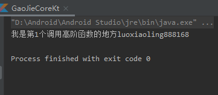
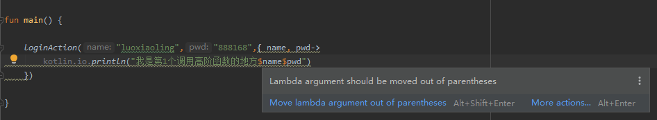
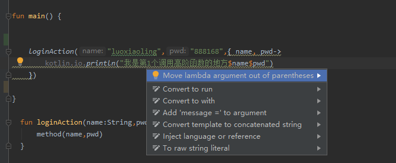
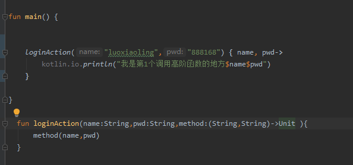

> 高阶函数的定义与调用

```kotlin
	
//TODO 1 这里是高阶函数的定义
  fun loginAction(name:String,pwd:String,method:(String,String)->Unit ){
      method(name,pwd)
  }

```

method:(String,String)->Unit  是对高阶函数的定义，实际上理解简单点，可以把(String,String)->Unit 看作一个类型，method:(String,String)->Unit 表示method属于(String,String)->Unit 这个类型，只不过(String,String)->Unit 这个类型特殊一点，它是接收两个参数，第一个参数是String类型，第二个参数是String类型，返回值为Unit的函数.

**如何调用**

1. 常规调用方法的方式调用

   ```kotlin
     loginAction("luoxiaoling","888168",{ name, pwd->
           kotlin.io.println("我是第1个调用高阶函数的地方$name$pwd")
       })
   ```

   这种传参方式很熟悉，就是载方法的（）依次传入对应类型的参数，这里看下第三个传参，用花括号括起来了，把他看成一个函数，name,pwd表示这个函数需要两个形参，->之后的表示函数体要执行的语句。

   这样写运行是没问题的，

   

但是这样的写法还是有问题的，有点不好看，如果传入的函数方法体执行的逻辑很多，这样写就更加难看了，实际上编辑器也是会提醒的



把鼠标放到波浪线，会给出优化提示：



优化后代码如下：




2.编辑器推荐写法

```kotlin
    loginAction("luoxiaoling","888168") { name, pwd->
        kotlin.io.println("我是第1个调用高阶函数的地方$name$pwd")
    }
```

这个写法在【1】有提过了，其实就是将要传的函数体这个参数放到括号外面来，这样更加美观可读性也更好。


3.第三种写法

实际上第2种写法刚开始看着是有些不习惯的，既然【1】提到直接将函数体放在括号内传参可读性不佳，那我们干脆用一个变量来代替函数体，如下：

```kotlin
   
	var method = {name:String,pwd:String->
        kotlin.io.println("我是第三个调用高阶函数的地方$name$pwd")
    }

    loginAction("luoxiaoling","888168",method)
```

以上看起来对初学者来说又比较容易接受一点，不过相信用久了kotlin，还是会觉得第【2】种是最佳的。


> 为高阶函数取别名

```kotlin
//TODO 使用typealias类型别名关键字取别名
typealias  Method = (String, String) -> Unit


//  fun loginAction(name:String,pwd:String,method:(String,String)->Unit ){
//      method(name,pwd)
//  }

//TODO 高阶函数定义
fun loginAction(name: String, pwd: String, method: Method) {
    method(name, pwd)
}
```


> 为类增加扩展函数

下面定义了GaoJieCore这个类，只定义了一个函数doSth

```kotlin
class  GaoJieCore{

    fun doSth(){
        println("GaoJieCore---dosth")
    }
}
```

为这个类增加一个扩展函数doAnotherSth：

```kotlin

fun GaoJieCore.doAnotherSth(){
    println("GaoJieCore---doAnotherSth")
}

```

那怎么使用呢：

```kotlin
fun main() {
    //TODO 调用扩展函数和调用普通函数没什么区别
    GaoJieCore().doAnotherSth()
    GaoJieCore().doSth()
   
}
//TODO 定义扩展函数
fun GaoJieCore.doAnotherSth(){
    println("GaoJieCore---doAnotherSth")
}

class  GaoJieCore{

    fun doSth(){
        println("GaoJieCore---dosth")
    }
}
```

**输出：**

GaoJieCore---doAnotherSth
GaoJieCore---dosth


> 为泛型增加扩展函数

```kotlin
//TODO <T> 是对泛型的说明
//TODO 以下代码是对T类型作扩展函数
//TODO T类型没有作类型限制，没有规定上限下限，意味着它可以是任何类型

fun <T> T.justRun(){
    println("justrun")
}
```

**调用**：

```kotlin
 	var a = 100
    a.justRun()
    var b = GaoJieCore()
    b.justRun()
```

**输出**：

justrun
justrun


**如果泛型的扩展函数有参数呢？**如下：

```kotlin
//TODO 因为形参引入一个新的泛型R,所以要增加泛型说明<T,R>
fun <T,R> T.justRun2(param:R){
    println("justRun2 $param")
}
```

**调用**：

```kotlin
    var a = 100
    a.justRun2(a)
    var b = GaoJieCore()
    b.justRun2("GaoJieCore")
```

**输出**：

justRun2 100
justRun2 GaoJieCore


**如果泛型扩展函数的形参是一个高阶函数呢？** 😂😂😂

```kotlin
//TODO 注意形参是一个高阶函数,返回类型是泛型

fun <T,R> T.justRun3(method:()->R){
    println("justRun3 ${method()}")//TODO 这里调用高阶函数，打印返回值
}
```

**调用**：

```kotlin
   var a = 100
    a.justRun3(){
        true//TODO 返回Boolean类型
    }
    var b = GaoJieCore()
    b.justRun3(){
        10086  //TODO  返回Int类型
    }

```

**输出**：

justRun3 true
justRun3 10086


**泛型扩展函数的形参是一个高阶函数**，**并且将高阶函数内化成泛型类的一个普通成员函数😂😂😂**

怎么理解后半截这句“**高阶函数内化成泛型类的一个普通成员函数**”，意思就是本来这个高阶函数属于一个形参，不属于泛型类的成员，它是外部传入的是“外人”，现在将这个“**高阶函数**”内化变成泛型类的一部分，即变成泛型类的成员方法，这样“外人”就变成“自己人”，这样有什么好处？既然人家“**高阶函数**”内化变成泛型类的一部分，变成泛型类的成员方法，那么在**高阶函数**中就可以**直接访问泛型类的东西了哦！！！**

```kotlin

//TODO 注意T.()写法不在是写成（）
//TODO T.()表示函数会被内化成T类的成员

fun <T,R> T.justRun4(method:T.()->R){
    println("justRun4 ${method()}")
}
```

**调用**：

```kotlin
var a = 100

a.justRun4(){//TODO （） 可以省略因为不用传参
    
    //TODO 因为高阶函数被Int内化了，这里可以直接调用Int的成员方法compareTo
    compareTo(20)
    true
}

var b = GaoJieCore()

b.justRun4(){ //TODO （） 可以省略因为不用传参
    
    //TODO 因为高阶函数被GaoJieCore内化了，这里可以直接调用GaoJieCore的成员方法doSth
    doSth()
    10086
}
```

**输出**：

justRun4 true
GaoJieCore---dosth
justRun4 10086


